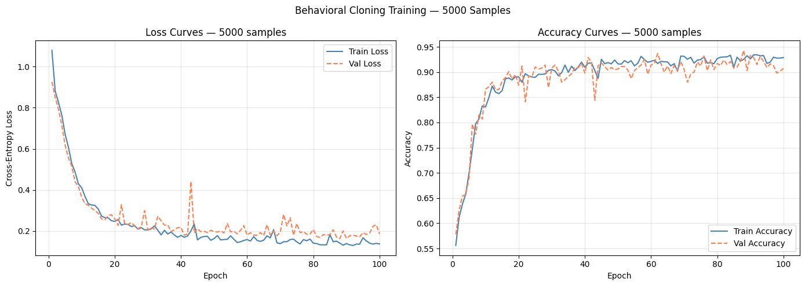
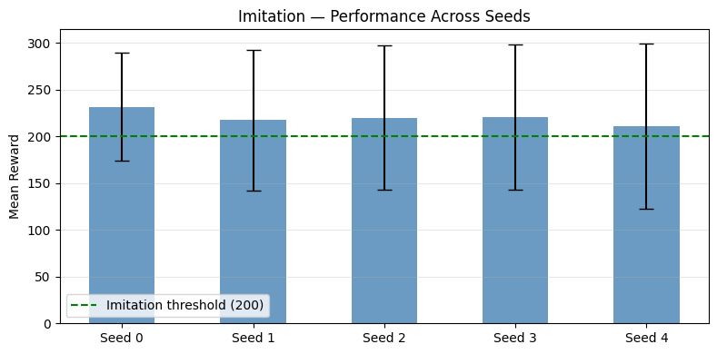
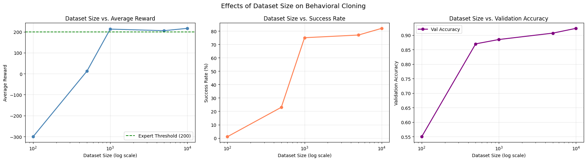
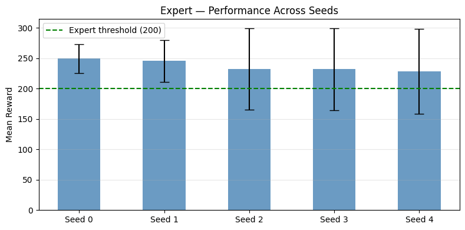
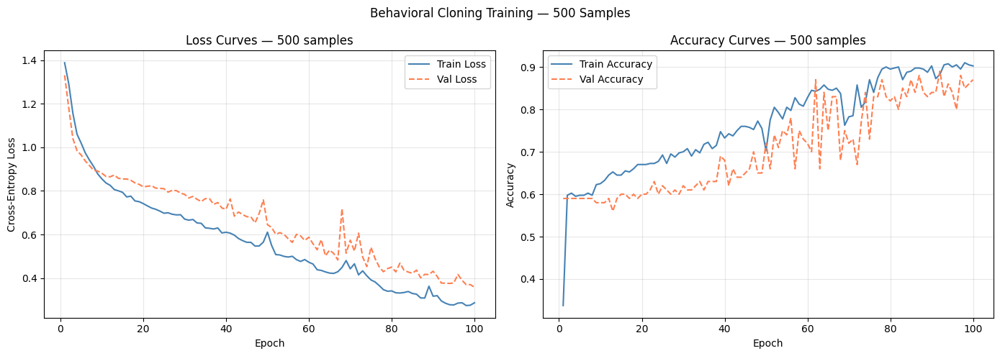
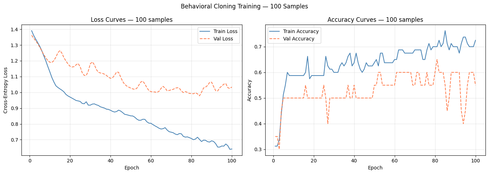
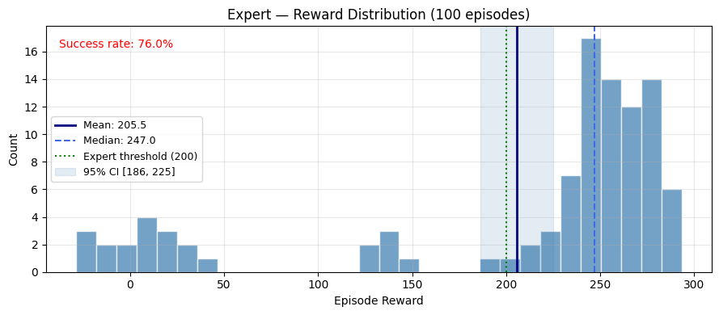
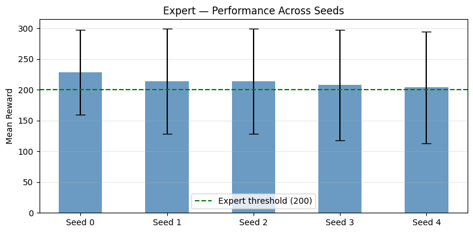

# Reinforcement Learning – Imitation Learning – Assignment 1

**Student 1:** Yaara Shterenbaum — 212857239  
**Student 2:** Ariel Keslassy — 312169527

---

## Overview and Assignment Goal

The objective of this project is to implement a full pipeline for Imitation Learning on the `LunarLander-v3` Gymnasium environment. Unlike traditional Reinforcement Learning (RL) which relies on trial and error, Imitation Learning relies on state-action pairs generated by an expert. This project covers training the RL expert, collecting demonstration data, training an imitation model via Behavioral Cloning, and exploring few-shot imitation learning techniques.

---

## Part A: Training an Expert RL Agent

To generate expert demonstrations, we used the **Stable-Baselines3 (SB3)** library to train an agent using the **Proximal Policy Optimization (PPO)** algorithm.

- **Design Choice:** PPO is a robust and sample-efficient on-policy algorithm. It is very useful and used in practice for many real-world problems.  
  The model was trained with a fixed learning rate of `3e-4` (for training stability) and a network architecture of `[256, 256]` — making sure it has sufficient parameters to learn the task while not being over-parametrized.
- **Performance:** It successfully met the expert criteria by achieving an average reward greater than 200 over the evaluation episodes.

---

## Part B1: Collecting Demonstration Data

Using the trained PPO expert, we simulated 200 collection episodes to generate a large pool of demonstration data.

- **Collection Stats:** We collected a total of 70,573 state-action transitions.
- **Expert Consistency:** During collection, the expert achieved a mean episode reward of 216.44 ± 87.49, confirming its stability as a demonstration source.
- **Subsampling:** From this master pool, we generated smaller datasets of sizes 100, 500, 1000, 5000, and 10000 transitions to analyze the effect of dataset size on the imitation model's performance.

---

## Part B2 & B3: Training and Evaluating the Imitation Model

We framed Behavioral Cloning as a standard multi-class classification problem where the model learns to map the 8-dimensional state observations to one of the 4 discrete actions.

- **Architecture:** We designed a 3-layer fully connected Neural Network with hidden dimensions of `256 -> 128 -> 64`. The network utilized ReLU activations.
- **Training Setup:** The model was optimized using the Adam optimizer (learning rate = `1e-3`) and Cross-Entropy loss. The data was split into an 80/20 train/validation ratio, and the data was batched using a batch size of 64 which we found empirically to generalize better.

For too small datasets, the imitation model didn't have enough information about how to properly navigate the environment, and the models quickly overfitted.  
**On the larger dataset we can observe generalization.**

### Training Curves — 100 Samples

### Training Curves — 500 Samples

### Training Curves — 5000 Samples

The 5000 examples imitation model achieved results **on par with the expert.**

### Reward Distribution & Seed Comparison

---

## Part B4: Dataset Size Analysis

Our experiments demonstrated a direct correlation between the volume of expert demonstrations and the behavioral cloning validation accuracy.

- Models trained on 100 and 500 samples struggled to capture the full complexity of the state space, resulting in lower validation accuracies and higher cross-entropy loss.
- Starting on 1,000 samples, the model was finally able to consistently solve the task.
- The model trained on 10,000 samples quickly converged, achieving over 90% validation accuracy and reliably landing the spacecraft during evaluation.

---

## Part B5: Few-Shot Imitation Learning

In this part we were challenged to achieve the minimal passing score (reward=200) with the least amount of data points.

To minimize the amount of data required, we experimented with few-shot imitation learning (budget sizes ranging from 2 to 1000 samples) by comparing several data selection strategies:

### 1. Random Sampling
The standard baseline utilizing a deterministic random seed.

### 2. Stratified Domain Knowledge
This strategy filters the data to include only transitions from successful episodes (reward ≥ 200) and then balances the core set across:
- **Actions:** Ensuring all 4 discrete actions are represented.
- **Spatial Coordinates:** Binning $x$ (horizontal) and $y$ (vertical) positions to ensure the model sees diverse landing and flight scenarios.

### 3. K-Center Greedy
In this strategy we use the expert's world knowledge and understanding of the task to search for meaningful data points. Specifically, we use the expert's latent space, assuming it represents the data points geometrically in a way that encodes their relation to each other and their importance for the task.

On this embedding space we perform the K-Center Greedy algorithm:
1. Pick a random point $c$ and add it to the centers $S$.
2. For every point $p$ in the dataset, find the nearest center: $c\_min = d(p, S) = \min_c \{dist(p, c)\}$
3. Pick a new point $p$ which is the furthest from $c\_min$: $p\_far = \max_p \{d(p, S)\}$
4. Add the new point as the next center: $S = S \cup \{p\_far\}$

This algorithm outputs $k$ centers that cover most of the data landscape (minimizing the distance of any point to the closest center). We also apply the same stratification method from section B5.2 to balance the samples before applying this method.

### 4. K-Means
In this algorithm we also search for centers on the expert's embedding space:
1. Pick $k$ random points and assign them as centers $S$.
2. For every point $p$ in the dataset, assign it to the cluster of the nearest center.
3. For every cluster, compute the new center as the mean of the points assigned to the cluster.
4. Repeat until convergence.

This algorithm captures the natural data distribution (in the expert's embedding space) and finds clusters that contain similar points w.r.t. the task. We also apply the same stratification method from section B5.2 to balance the samples before applying this method.

### 5. Non-Adaptive GradMatch
GradMatch (Killamsetty et al., ICML 2021) is a data selection strategy that aims to find a small subset (a coreset) of data whose weighted gradient closely matches the gradient of the entire dataset. By ensuring the gradient direction of the subset is similar to the full population, the model can theoretically achieve similar training dynamics with significantly fewer samples.

**Standard GradMatch vs. Our Variant:**
- **Standard GradMatch:** Typically requires a "warm-start" (training on the full dataset for $R$ epochs) to get the model to a state where its gradients are meaningful, followed by adaptive subset selection during training.
- **Our Non-Adaptive Variant:** Since our goal is extreme efficiency (Few-Shot), we want to avoid any warm-up on the full dataset. We achieve this by leveraging the Expert Model as a proxy. Instead of using the evolving gradients of the model being trained, we calculate the gradients relative to the expert's fixed knowledge. This allows us to select a high-quality coreset before training ever begins.

**How it Works:**
1. We used the same stratification method from section B5.2 to balance the samples.
2. **Proxy Gradients:** We pass the data through the expert to calculate the gradients for the final layer.
3. **Selection:** We use a greedy matching algorithm to find samples whose expert-based gradients best represent the average gradient of the entire expert-collected pool.
4. **One-Shot Selection:** Unlike standard GradMatch which re-selects data periodically, we select our budget once and train our BC model exclusively on that fixed coreset.

---

### Comparative Analysis

We used these methods to create subsets of sizes [2, 5, 10, 20, 50, 100, 500, 1000]. We trained the same imitation model (section B2) from scratch on all these different subsets created by each method. We performed this process along 5 different seeds and averaged the results to avoid outlier results.

**Key Findings:**
1. Most algorithms consistently out-performed the random baseline.
2. **The stratified K-Means performed the best, passing the reward=200 threshold with just 50 training samples!**
   - At that scale, domain knowledge and stratified K-Center methods were close to the threshold and produced decent results.
3. The domain knowledge method achieved relatively better results even in the extreme cases (subset size ≤ 10).
4. At subset size = 500, all of the methods passed the reward=200 threshold, indicating that with enough data, even naive solutions work.

---

### What matters more in this task: data quantity or data quality?

Generally more data (quantity) is better, as confirmed by our Part B4 analysis which showed a direct correlation between dataset volume (up to 10,000 transitions) and generalization. This is generally because deep neural networks trained with SGD (and its variants) have implicit regularization that promotes generalization and filters noise (*Understanding deep learning requires rethinking generalization*, Zhang et al., ICLR 2017). However, for extreme cases of data scarcity, we showed that a high-quality, targeted coreset can significantly improve the results and even match those of the models trained on full datasets.
